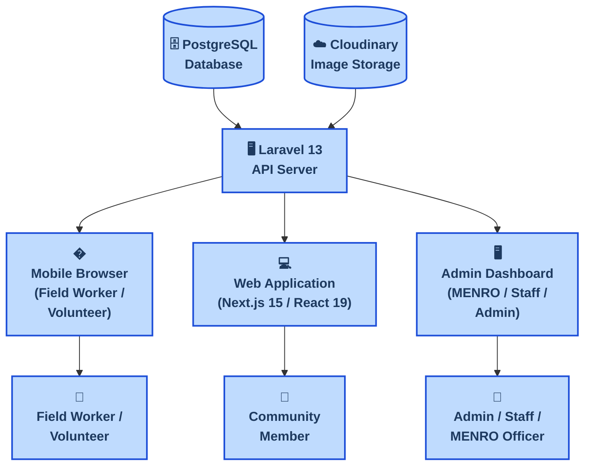

# BAKAWATCH — Proposed System Architecture

```mermaid
flowchart TD

    %% ── Row 1: Database + Server (top) ───────────────────────
    DB[("🗄️ PostgreSQL\nDatabase")]
    SERVER["🖥️ Laravel 13\nAPI Server"]

    %% ── Row 2: Client Applications (middle) ──────────────────
    APP1["�\nMobile Browser\n(Field Worker /\nVolunteer)"]
    APP2["💻\nWeb Application\n(Next.js 15 / React 19)"]
    APP3["🖥️\nAdmin Dashboard\n(MENRO / Staff /\nAdmin)"]

    %% ── Row 3: Users (bottom) ─────────────────────────────────
    U1["🧍\nField Worker /\nVolunteer"]
    U2["🧍\nCommunity\nMember"]
    U3["🧍\nAdmin / Staff /\nMENRO Officer"]

    %% ── External ──────────────────────────────────────────────
    CDN[("☁️ Cloudinary\nImage Storage")]

    %% ── Connections ───────────────────────────────────────────
    DB    --> SERVER
    CDN   --> SERVER
    SERVER --> APP1
    SERVER --> APP2
    SERVER --> APP3
    APP1  --> U1
    APP2  --> U2
    APP3  --> U3

    %% ── Styling ───────────────────────────────────────────────
    classDef db     fill:#bfdbfe,stroke:#1d4ed8,stroke-width:2px,color:#1e3a5f,font-weight:bold
    classDef server fill:#bfdbfe,stroke:#1d4ed8,stroke-width:2px,color:#1e3a5f,font-weight:bold
    classDef app    fill:#bfdbfe,stroke:#1d4ed8,stroke-width:2px,color:#1e3a5f,font-weight:bold
    classDef user   fill:#bfdbfe,stroke:#1d4ed8,stroke-width:2px,color:#1e3a5f,font-weight:bold

    class DB,CDN db
    class SERVER server
    class APP1,APP2,APP3 app
    class U1,U2,U3 user
```
